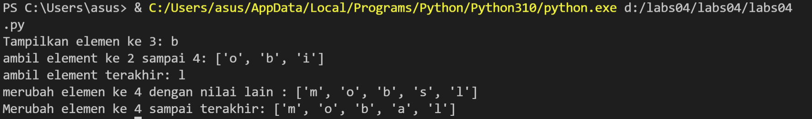

# labs04
## Latihan 1
<p>  
    Latihan membuat daftar dengan menulis :


```python 
print daftar =[]
```
   <p> Berikut programnya dalam python :<p>


<p>   Keterangan :<p>

<p> ● dibwah adalah listnya <p>

 ```python
list = ["m", "o", "b", "i", "l"] 
```

<p> ● dibawah ini untuk perintah untuk menampilkan elemen ke 3 dalam daftar , karena elemen ke 3 ada di indeks 2 , maka didalam daftar menggunakan kurung siku [2].<p>

```python
print("Tampilkan elemen ke 3:", list[2])
```
<p> ● dibawah ini untuk perintah mengambil elemen ke 2 sampai ke 4 dengan elemen indeks ada di indeks 1 sampai 4. <p>

```python
print("ambil element ke 2 sampai 4:", list[1:4])
```

<p> ● kemudian dibawah ini perintah untuk mengambil elemen terakhir , karena didalam  list ada 5 elemen , maka digunakan -1 untuk mengambil elemen terakhir.<p>

```python
print("ambil element terakhir:", list[-1])
```
### mengubah elemen ke 4 dengan nilai lain 

<p>Untuk mengubah elemen ke 4 dengan nilai S gunakan kode sebagai berikut:

```python
daftar [ 3 ] =  "s"
```

<p>Lalu tampilkan perubahannya dengan kode berikut:<p>

```python
print ( "merubah elemen ke 4 dengan nilai lain:" , list )
```
<p>Untuk mengubah elemen ke 4 sampai terakhir gunakan kode berikut:<p>

```python
daftar [ 3 :] =  "a" , "l"
```

<p>Ini untuk mengubah elemen ke 4 sampai terakhir dengan string "f" dan "g". gunakan kode berikut:<p>

```python
print ( "merubah elemen ke sampai elemen terakhir:" , list )
```
<p>Berikut hasil programnya :<p>


